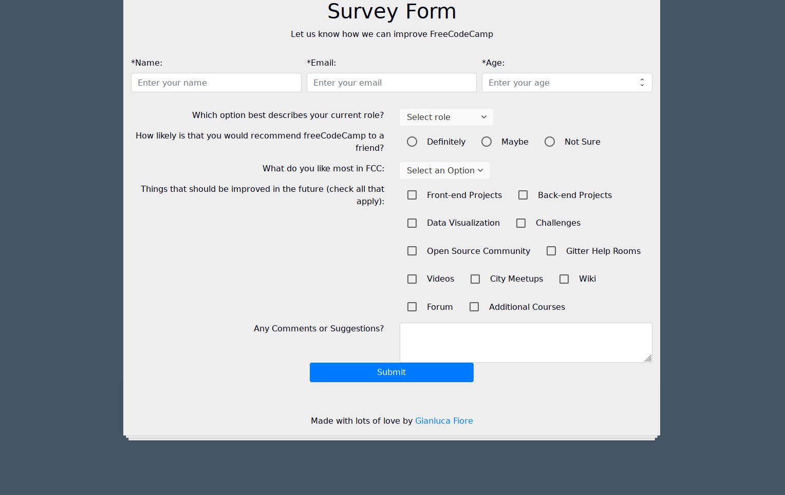
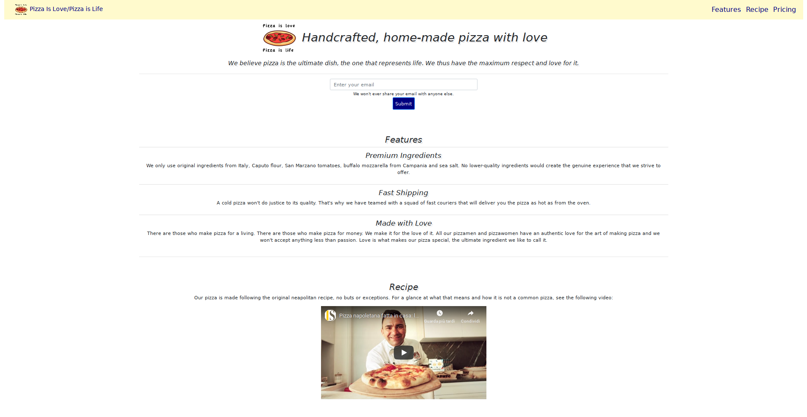
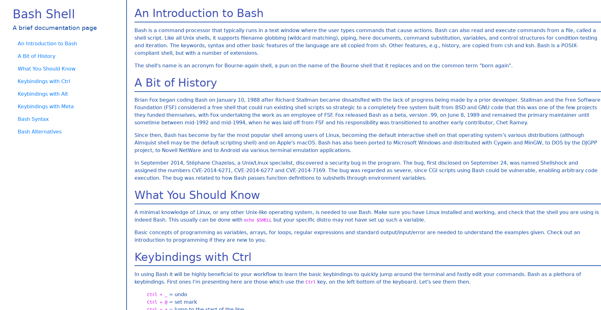
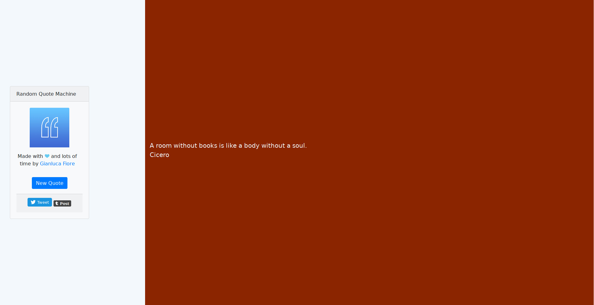
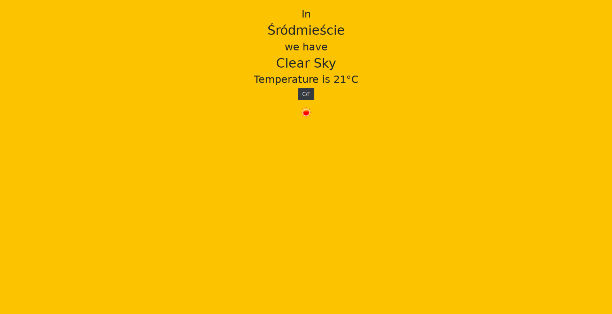

# Freecodecamp Portfolio

Collection of Freecodecamp projects, Just the most advanced ones, as it making this repository a basic portfolio

+ **Survey Form**

+ **Product Landing Page**

+ **Technical Documentation Page**

+ **Random Quote Machine**

+ **Local Weather App**

## Contribute

PRs accepted. Not solutions as it would defeat the purpose of Freecodecamp but typos, better explanations and simila are welcomed

## License

MIT © Gianluca Fiore

